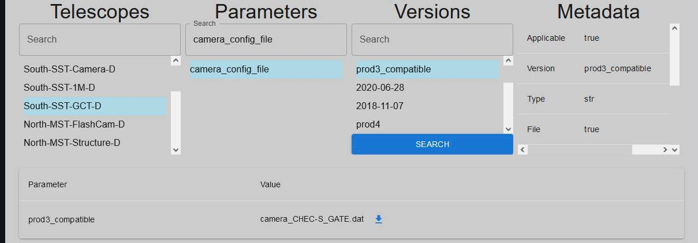

# DESY

This project was developed to address the specific needs of professionals in the field, aiming to streamline their access to telescope data. The objective is to enhance the efficiency of data analysis, enabling engineers to make informed decisions and derive valuable insights within the realm of astronomy.

## Description
This application has been developed to streamline the work of engineers, providing them with a convenient way to access and analyze telescope data. Users can easily select a telescope using the search field, then specify parameter and versions. The option to choose multiple versions adds extra flexibility. After selection, engineers can view and analyze the data in a user-friendly format, significantly simplifying the process of gaining valuable insights.

## Technologies

- TypeScript
- React
- Python
- FastAPI
- MongoDB

## Instructions

### Backend Setup:

1. Download the MongoDB server and MongoDB Compass.
2. Install necessary tools for the backend:
    - Open the terminal.
    - Navigate to the "backend" folder.
    - Install pipenv: `pip install pipenv`.
    - Activate the virtual environment: `pipenv shell`.
    - Install dependencies: `pipenv install -r requirements.txt`.
    - Run the server with the command: `uvicorn main:app --reload`.
3. Add the proper database connection string in "Database.py"

### Frontend Setup:

1. Install necessary tools for the frontend:
    - Install Node.js.
    - Open the terminal.
    - Navigate to the "frontend" folder.
    - Run the command: `npm install`. This will install all required packages.
    - Run the frontend with the command: `npm run dev`.
